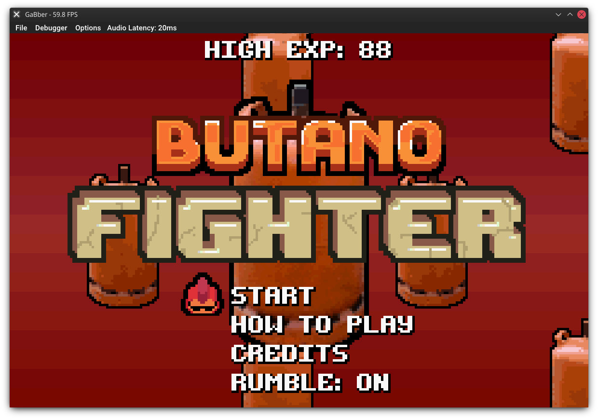
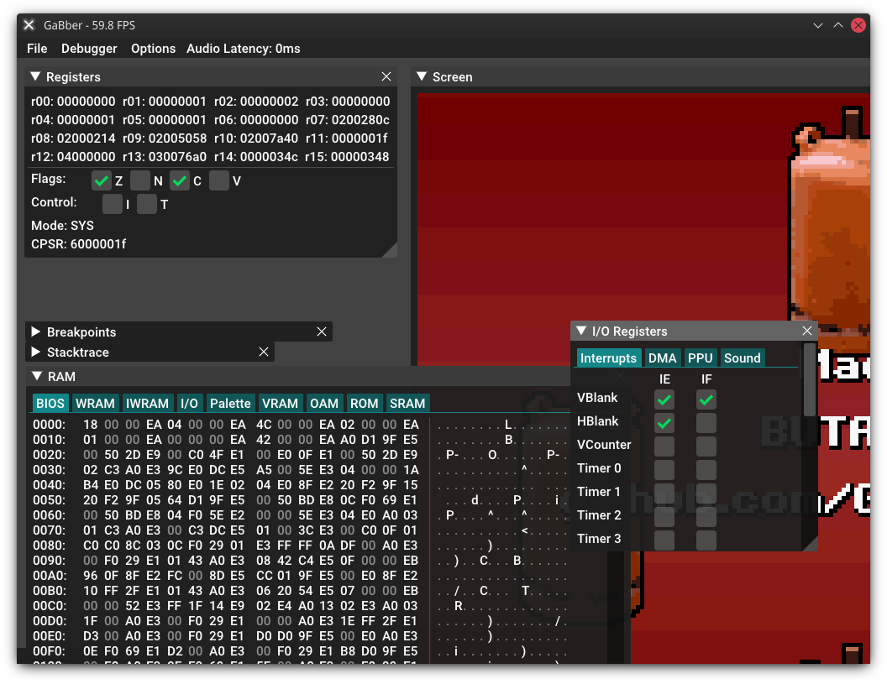

# GaBber

A Game Boy Advance emulator, written in C++. 

 

 

# Features

- Built-in debugger
- Questionable emulation accuracy
- Professional, ImGui-based user interface

On a more serious note, this was made as a hobby project and turned into a thesis. 
GaBber is not meant to be better than any of the already existing emulators, but a fun side-project.

# Compiling

The following libraries are required to compile GaBber:

- GLEW
- SDL2
- fmt
- soxr

GaBber uses CMake as it's build system, out of tree builds are preferred. 
After cloning the repository, you may have to initialize the Git submodules like so:

```shell
git submodule init
git submodule update
```

Alternatively, clone with the ```--recurse-submodules``` flag.

To compile GaBber, run the following:

```shell
mkdir build/ && cd build/
cmake ../
make
```

The built executable is automatically copied to the repository root.

# Usage

Before running, make sure that a valid ```bios.bin``` is located in the current directory. 

```shell
./GaBber <path-to-rom>
```

# Debugger

The debugger can be toggled at any time via the key combination ```SHIFT```+```TAB```.
Emulation is paused when opening the debugger, but can be resumed again by pressing ```F5```. 
The ```F3``` key can be used to execute to the next instruction.

# Development

GaBber uses clang-format for code formatting. After making any changes, please re-run clang-format on the modified files.

# License

GaBber is licensed under the MIT license. For more information, see the [LICENSE file](LICENSE).